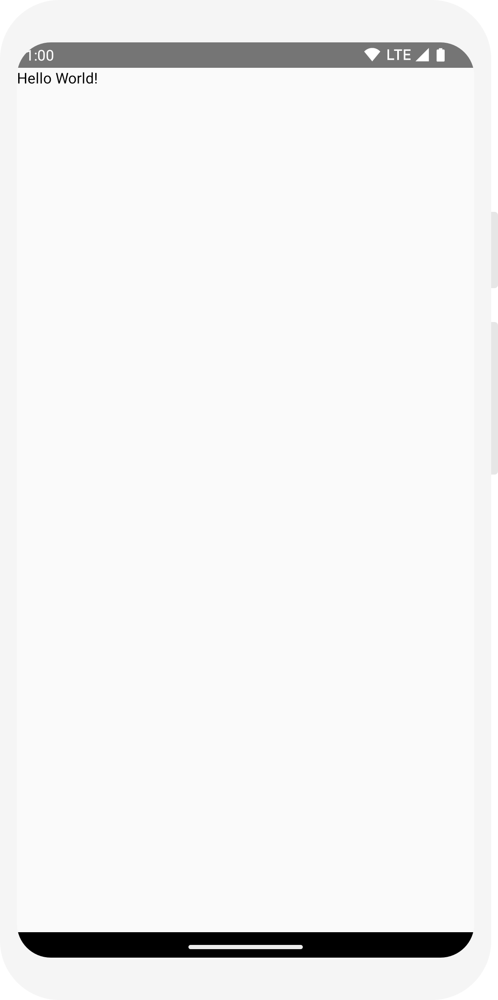
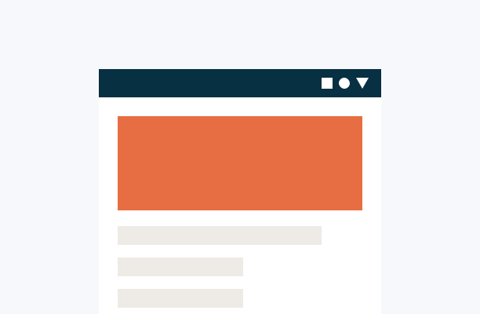
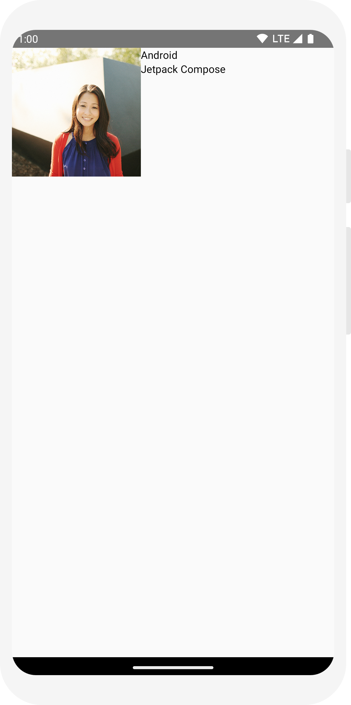
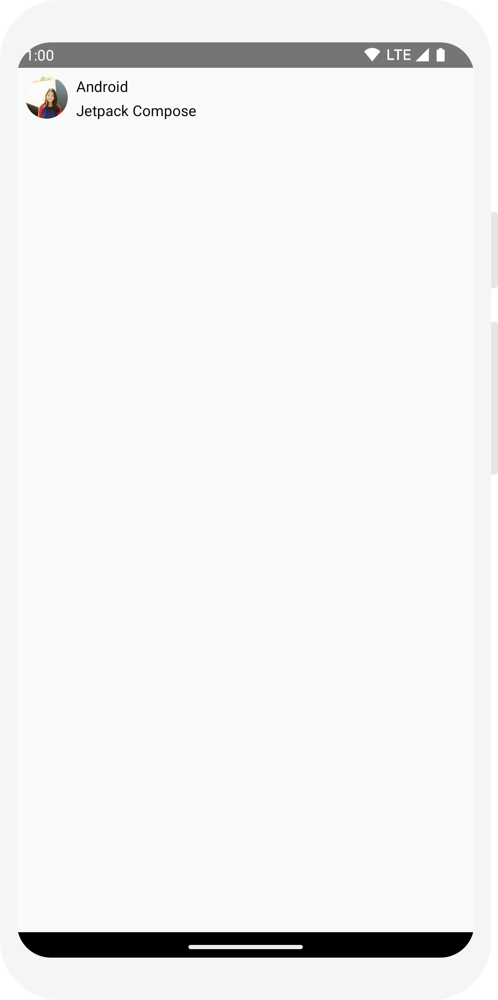
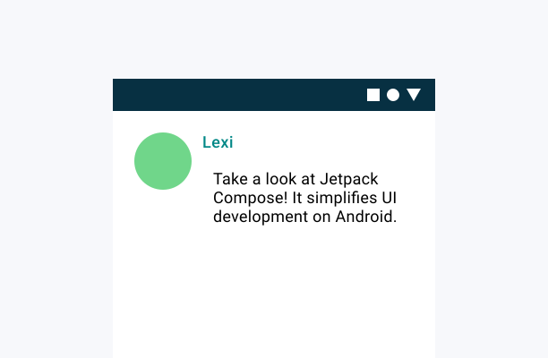
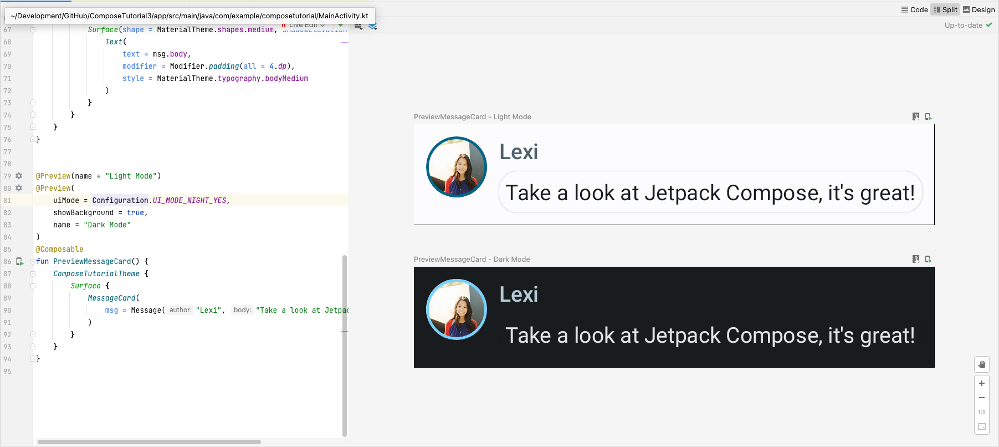
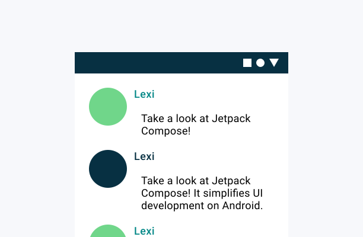
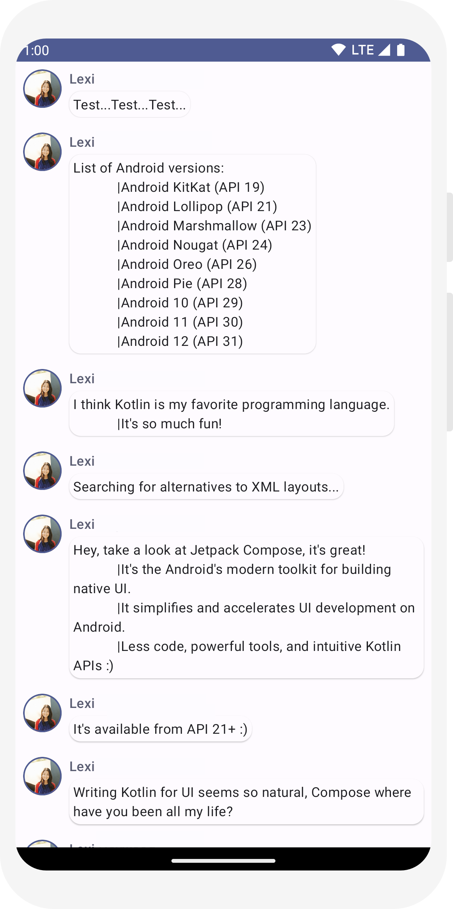

# Tutorial Básico de Desenvolvimento Mobile com Jetpack Compose

O Jetpack Compose é um kit de ferramentas moderno para criar UI nativa do Android. O Jetpack Compose simplifica e acelera o desenvolvimento de UI no Android com menos código, ferramentas poderosas e APIs Kotlin intuitivas.

### Antes de tudo

Crie um projeto com o nome de `JetpackComposeTutorial` e selecione a linguagem `Kotlin` e o template `Empty Compose Activity`.

Para começar, utilize a versão mais recente do Android Studio e crie um aplicativo selecionando Novo Projeto e, na categoria Telefone e Tablet, selecione Atividade Vazia. Nomeie seu aplicativo JetpackComposeTutorial e clique em Concluir. O template padrão já contém alguns elementos do Compose, mas neste tutorial você o criará passo a passo.

## Lição 1: Composables Functions

O Jetpack Compose é construído em torno de funções componíveis. Essas funções permitem que você defina a interface do seu aplicativo programaticamente, descrevendo como ela deve parecer e fornecendo dependências de dados, em vez de focar no processo de construção da interface (inicializar um elemento, anexá-lo a um pai, etc.). Para criar uma função componível, basta adicionar a anotação `@Composable` ao nome da função.

Ao executar o projeto ou visualizar em previw, você verá a mensagem "Hello Android!" na tela. 

<div style="width:100%; display:flex; background:#cccccc; margin-bottom: 10px;">
	
</div>

### Defina uma função `@Composable`

Para tornar uma função Composable, adicione a anotação `@Composable`. Para testar isso, defina uma função MessageCard que recebe um nome e a usa para configurar o elemento de texto.

```kotlin
// ...
import androidx.compose.ui.tooling.preview.Preview

@Composable
fun MessageCard(name: String) {
    Text(text = "Hello $name!")
}

@Preview
@Composable
fun PreviewMessageCard() {
    MessageCard("Android")
}
```

### Visualize sua função no Android Studio

A anotação `@Preview` permite que você visualize suas funções composable no Android Studio sem precisar compilar e instalar o aplicativo em um dispositivo Android ou emulador. A anotação deve ser usada em uma função composable que não aceite parâmetros. Por esse motivo, você não pode visualizar a função MessageCard diretamente. Em vez disso, crie uma segunda função chamada `PreviewMessageCard`, que chama `MessageCard` com um parâmetro apropriado. Adicione a anotação `@Preview` antes de `@Composable`.

## Lição 2: Layouts

Os elementos de UI são hierárquicos, com elementos contidos em outros elementos. No Compose, você cria uma hierarquia chamando Composable Funcions de outras Composable Functions. Para organizar elementos de UI, você pode usar layouts, como `Column`, `Row`, `Box` e `Surface`. Nesta lição, você aprenderá a criar layouts simples e a adicionar elementos de texto e imagem a eles.

<div style="width:100%; display:flex; background:#cccccc; margin-bottom: 10px;">
	
</div>

### Adicione vários textos

Até agora você construiu sua primeira função componível e pré-visualização! Para descobrir mais recursos do Jetpack Compose, você construirá uma tela de mensagens simples contendo uma lista de mensagens que podem ser expandidas com **algumas** animações.

Comece tornando a mensagem mais rica exibindo o nome do autor e o conteúdo da mensagem. Você precisa primeiro alterar o parâmetro para aceitar um objeto `Message` em vez de uma `String` e adicionar outra função `Text` dentro da função `MessageCard`. Certifique-se de atualizar a pré-visualização também.

Seu código deve se parecer com o seguinte:

```kotlin
// ... Importações anteriores

class MainActivity : ComponentActivity() {
    override fun onCreate(savedInstanceState: Bundle?) {
        super.onCreate(savedInstanceState)
        setContent {
            MessageCard(Message("Onofre", "Estou amando isso aqui"))
        }
    }
}

// data class é uma classe que só tem dados, sem funcionalidades. Serve para armazenar dados.
// Nesse caso a data class Message armazena o autor e a mensagem.
data class Message(val author: String, val body: String)

@Composable
fun MessageCard(msg: Message) {
    Text(text = msg.author)
    Text(text = msg.body)
}

@Preview
@Composable
fun PreviewMessageCard() {
    MessageCard(
        msg = Message("Onofre", "Olha só o que eu fiz!")
    )
}

```
Este código cria dois elementos de texto dentro da visualização de conteúdo. No entanto, como você não forneceu nenhuma informação sobre como organizá-los, os elementos de texto são desenhados um em cima do outro, tornando o texto ilegível.


### Adicione um layout

Usando um layout `Column`, você pode organizar os elementos de texto verticalmente. O layout `Column` é um composable que coloca seus filhos em uma sequência vertical. Para usar o layout `Column`, envolva os elementos `Text` em um composable `Column`.

Você pode usar `Row` para organizar itens horizontalmente e `Box` para empilhar elementos.

```kotlin
    Column {
        Text(text = msg.author)
        Text(text = msg.body)
    }
```

### Adicione um elemento de imagem

Enriqueça seu cartão de mensagem adicionando uma foto de perfil do remetente. Use o `Resource Manager` (Menu Principal -> Tools -> Resource Manager ) para importar uma imagem da sua biblioteca de fotos. Adicione uma função `Row`  para ter um design bem estruturado e um `Image` dentro dele. Nesse caso o nome da imagem é `profile_picture`.

```kotlin
@Composable
fun MessageCard(msg: Message) {
    Row {
        Image(
            painter = painterResource(R.drawable.profile_picture),
            contentDescription = "Foto de Perfil",
        )
    
       Column {
            Text(text = msg.author)
            Text(text = msg.body)
        }
  
    }
}
```	

<div style="width:100%; display:flex; background:#cccccc; margin-bottom: 10px;">
	
</div>

### Configure seu layout

O layout da sua mensagem tem a estrutura correta, mas seus elementos não estão bem espaçados e a imagem é muito grande! Para decorar ou configurar um composable, o Compose usa modificadores. Eles permitem que você altere o tamanho, o layout, a aparência do composable ou adicione interações de alto nível, como tornar um elemento clicável. Você pode encadeá-los para criar composables mais ricos. Você usará alguns deles para melhorar o layout.

```kotlin
    // Função MessageCard

    @Composable
    fun MessageCard(msg: Message) {
    // Adicionar preenchimento/espaçamento ao redor da nossa mensagem
    Row(modifier = Modifier.padding(all = 8.dp)) {
        Image(
            painter = painterResource(R.drawable.profile_picture),
            contentDescription = "Foto de Perfil",
            modifier = Modifier
                // Defina o tamanho da imagem para 40 dp
                .size(40.dp)
                // Recorte a imagem para que ela fique em forma de círculo
                .clip(CircleShape)
        )

        // Adicione um espaço horizontal entre a imagem e a coluna
        Spacer(modifier = Modifier.width(8.dp))

        Column {
            Text(text = msg.author)
            // Adicione um espaço vertical entre o autor e os textos da mensagem
            Spacer(modifier = Modifier.height(4.dp))
            Text(text = msg.body)
        }
    }
}
```

<div style="width:100%; display:flex; background:#cccccc; margin-bottom: 10px;">
	
</div>

## Lição 3: Material Design

O Compose foi criado para dar suporte aos princípios do [Material Design](https://m3.material.io/). Muitos dos seus elementos de UI implementam o Material Design "de fábrica". Nesta lição, você estilizará seu aplicativo com widgets do Material Design.

<div style="width:100%; display:flex; background:#cccccc; margin-bottom: 10px;">
	
</div>


## Use o Material Design

O design da sua mensagem agora tem um layout, mas ainda não está ótimo.

O Jetpack Compose fornece uma implementação do Material Design 3 e seus elementos de UI prontos para uso. Você melhorará a aparência do nosso `MessageCard` composable usando o estilo Material Design.

Para começar, envolva a função `MessageCard` com o tema Material criado no seu projeto, `ComposeTutorialTheme`, bem como uma `Surface`. Faça isso tanto na função `@Preview` quanto na função `setContent`. Isso permitirá que seus composables herdem estilos conforme definido no tema do seu aplicativo, garantindo consistência em todo o seu aplicativo.

O Material Design é construído em torno de três pilares: Cor, Tipografia e Forma. Você os adicionará um por um.

**Observação:** o modelo Empty Compose Activity gera um tema padrão para seu projeto que permite que você personalize o `MaterialTheme`. Se você nomeou seu projeto de algo diferente de `JetpackComposeTutorial`, você pode encontrar seu tema personalizado no arquivo `Theme.kt` no subpacote `ui.theme`.

### Cor

Use `MaterialTheme.colorScheme` para estilizar com cores do tema encapsulado. Você pode usar esses valores do tema em qualquer lugar que uma cor seja necessária. Este exemplo usa cores de tema dinâmicas (definidas pelas preferências do dispositivo). Você pode definir `dynamicColor` como false no arquivo `MaterialTheme.kt` para alterar isso.

Estilize o título e adicione uma borda à imagem.

### Tipografia

Estilos de tipografia do Material estão disponíveis no `MaterialTheme`, basta adicioná-los aos composables `Text`.

### Shape (Forma)

Com o Shape, você pode adicionar os toques finais. Primeiro, envolva o texto do corpo da mensagem em torno de um Surface composable. Isso permite personalizar o formato e a elevação do corpo da mensagem. O preenchimento também é adicionado à mensagem para um melhor layout.

Exemplo de código com as alterações feitas:

```kotlin
fun MessageCard(msg: Message) {
   Row(modifier = Modifier.padding(all = 8.dp)) {
       Image(
           painter = painterResource(R.drawable.profile_picture),
           contentDescription = null,
           modifier = Modifier
               .size(40.dp)
               .clip(CircleShape)
               .border(1.5.dp, MaterialTheme.colorScheme.primary, CircleShape)
       )

       Spacer(modifier = Modifier.width(8.dp))

       Column {
          Text(
               text = msg.author,
               color = MaterialTheme.colorScheme.secondary,
               style = MaterialTheme.typography.titleSmall
           )

           Spacer(modifier = Modifier.height(4.dp))

           Surface(shape = MaterialTheme.shapes.medium, shadowElevation = 1.dp) {
               Text(
                   text = msg.body,
                   modifier = Modifier.padding(all = 4.dp),
                   style = MaterialTheme.typography.bodyMedium
               )
           }
       }
   }
}
```

### Habilitar o tema escuro 

Quando necessário, o tema escuro (ou modo noturno) pode ser habilitado para evitar uma tela brilhante, especialmente à noite, ou simplesmente para economizar a bateria do dispositivo. Graças ao suporte do Material Design, o Jetpack Compose pode lidar com o tema escuro por padrão. Tendo usado cores, texto e fundos do Material Design se adaptarão automaticamente ao fundo escuro.

Você pode criar várias visualizações em seu arquivo como funções separadas ou adicionar várias anotações à mesma função.

Adicione uma nova anotação de visualização e habilite o modo noturno.

Altere a sua função `PreviewMessageCard` para incluir o modo noturno.

```kotlin
@Preview(name = "Light Mode")
@Preview(
    uiMode = Configuration.UI_MODE_NIGHT_YES,
    showBackground = true,
    name = "Dark Mode"
)
@Composable
fun PreviewMessageCard() {
   JetpackComposeTutorialTheme {
    Surface {
      MessageCard(
        msg = Message("Onofre", "Olha só o que eu fiz!")
      )
    }
   }
}
```

As opções de cores para os temas claro e escuro são definidas no arquivo `Theme.kt` gerado pela IDE Android Studio.

Até agora, você criou um elemento de UI de mensagem que exibe uma imagem e dois textos com estilos diferentes, e fica bem tanto em temas claros quanto escuros!

<div style="width:100%; display:flex; background:#cccccc; margin-bottom: 10px;">
	
</div>

## Lição 4: Listas e animações

Listas e animações estão por toda parte nos aplicativos. Nesta lição, você aprenderá como o Compose facilita a criação de listas e torna divertido adicionar animações.

<div style="width:100%; display:flex; background:#cccccc; margin-bottom: 10px;">
	
</div>

### Crie uma lista de mensagens

Um bate-papo com uma mensagem parece um pouco solitário, então vamos mudar a conversa para ter mais de uma mensagem. 

Vamos criar um objeto para armazenar uma lista de mensagens de exemplo. 

```kotlin
// `Criamos um objeto de amostra para simular dados de amostra`

 object SampleData {
    val conversationSample = listOf(
        Message("Onofre", "Hoje o dia vai ser incrível!"),
        Message("Bozanka", "Estou aprendendo muito neste universo. E essa mensagem é muito grande para caber em uma única linha."),
        Message("Licurgo", "Cuidado com o Leopardo."),
        Message("Ovalino", "Obrigado por acreditarem em mim."),
        Message("Cafiasparino", "Eu sou a flor silvestre que perfuma os campos! E essa mensagem é muito grande para caber em uma única linha.\"),"),
        Message("Ubelino", "Meu Amor... Aqui Está sua filha."),
        Message("Guilhermina", "Não contavam com a minha astúcia."),
        Message("Fedegunda", "Eu sou o mestre do universo!"),
        Message("Adamastor", "Chaves e Chapolin Colorado."),
        Message("Aretha", "Se você é jovem ainda, jovem ainda, jovem ainda. E essa mensagem é muito grande para caber em uma única linha.\"),"),
        Message("Abeba", "Amanhã é um novo dia."),
        Message("Epaminondas", "Ao infinito e além!"),
    )
}
```


### LazyColumn e LazyRow

Agora, você precisará criar uma função `Conversation` que mostrará várias mensagens. Para este caso de uso, use `LazyColumn` e `LazyRow` do Compose. Esses elementos renderizam apenas os elementos que são visíveis na tela, então eles são projetados para serem muito eficientes para listas longas.

Neste trecho de código, você pode ver que `LazyColumn` tem um items dentro dele, que chamaremos de "filhos". `LazyColumn` pega uma List como parâmetro e seu lambda recebe um parâmetro que chamamos de message (poderíamos ter chamado como quiséssemos), que é uma instância de `Message`. Em resumo, esse função lambda é chamada para cada item da `List` fornecida. Copie o conjunto de dados de exemplo para seu projeto para ajudar a inicializar a conversa rapidamente.

```kotlin
import androidx.compose.foundation.lazy.LazyColumn
import androidx.compose.foundation.lazy.items

@Composable
fun Conversation(messages: List<Message>) {
    LazyColumn {
        items(messages) { message ->
            MessageCard(message)
        }
    }
}

@Preview
@Composable
fun PreviewConversation() {
    JetpackComposeTutorialTheme {
        Conversation(SampleData.conversationSample)
    }
}
```
<div style="width:100%; display:flex; background:#cccccc; margin-bottom: 10px;">
	
</div>

## Animar mensagens enquanto elas se expandem

A conversa está ficando mais interessante. É hora de brincar com animações! Você adicionará a capacidade de expandir uma mensagem para mostrar uma mais longa, animando o tamanho do conteúdo e a cor de fundo. Para armazenar esse estado da UI local, você precisa controlar se uma mensagem foi expandida ou não. Para controlar essa mudança de estado, você precisa usar as funções `remember` e `mutableStateOf`.

As funções composable podem armazenar o estado local na memória usando `remember` e rastrear as alterações no valor passado para `mutableStateOf`. Composables (e seus filhos) usando esse estado serão redesenhados automaticamente quando o valor for atualizado. Isso é chamado de **recomposição** ("recomposotion" em inglês).

Ao usar as APIs de estado do Compose, como `remember` e `mutableStateOf`, quaisquer alterações no estado atualizam automaticamente a interface.

Vídeo da animação:

[Clique para assistir](tutorial/lesson4-03_m3.mp4)

Agora você pode alterar o plano de fundo do conteúdo da mensagem com base em `isExpanded` quando clicamos em uma mensagem. Você usará o modificador clicável para manipular eventos de clique na função. Em vez de apenas alternar a cor de fundo da `Surface`, você animará a cor de fundo modificando gradualmente seu valor de `MaterialTheme.colorScheme.surface` para MaterialTheme.`colorScheme.primary` e vice-versa. Para fazer isso, você usará a função `animateColorAsState`. Por fim, você usará o modificador `animateContentSize` para animar o tamanho do contêiner da mensagem suavemente:

```kotlin
@Composable
fun MessageCard(msg: Message) {
    Row(modifier = Modifier.padding(all = 8.dp)) {
        Image(
            painter = painterResource(R.drawable.profile_picture),
            contentDescription = null,
            modifier = Modifier
                .size(40.dp)
                .clip(CircleShape)
                .border(1.5.dp, MaterialTheme.colorScheme.secondary, CircleShape)
        )
        Spacer(modifier = Modifier.width(8.dp))

        // Acompanhamos se a mensagem é expandida ou não nesta variável
        var isExpanded by remember { mutableStateOf(false) }

        // surfaceColor será atualizado gradualmente de uma cor para outra
        val surfaceColor by animateColorAsState(
            if (isExpanded) MaterialTheme.colorScheme.primary else MaterialTheme.colorScheme.surface,
        )

        // Alternamos a variável isExpanded quando clicamos nesta coluna
        Column(modifier = Modifier.clickable { isExpanded = !isExpanded }) {
            Text(
                text = msg.author,
                color = MaterialTheme.colorScheme.secondary,
                style = MaterialTheme.typography.titleSmall
            )

            Spacer(modifier = Modifier.height(4.dp))

            Surface(
                shape = MaterialTheme.shapes.medium,
                shadowElevation = 1.dp,
                // a cor da surfaceColor mudará gradualmente do primário para a superfície
                color = surfaceColor,
                // animateContentSize mudará o tamanho da superfície gradualmente
                modifier = Modifier.animateContentSize().padding(1.dp)
            ) {
                Text(
                    text = msg.body,
                    modifier = Modifier.padding(all = 4.dp),
                   // Se a mensagem for expandida, exibimos todo o seu conteúdo, caso contrário, exibimos apenas a primeira linha
                    maxLines = if (isExpanded) Int.MAX_VALUE else 1,
                    style = MaterialTheme.typography.bodyMedium
                )
            }
        }
    }
}
```

## Próximos passos 

Agora que você aprendeu o básico do Jetpack Compose, você pode explorar mais recursos e criar aplicativos mais complexos. Aqui estão algumas sugestões para continuar sua jornada:

1. Altere o design do seu aplicativo para adicionar mais elementos de Material Design, como botões, caixas de diálogo e barras de aplicativos.

2. Customizar a função messageCard para aceitar mais parâmetros, como uma imagem de perfil e um horário de envio.

3. Adicione um campo de entrada de texto para permitir que os usuários enviem novas mensagens.
